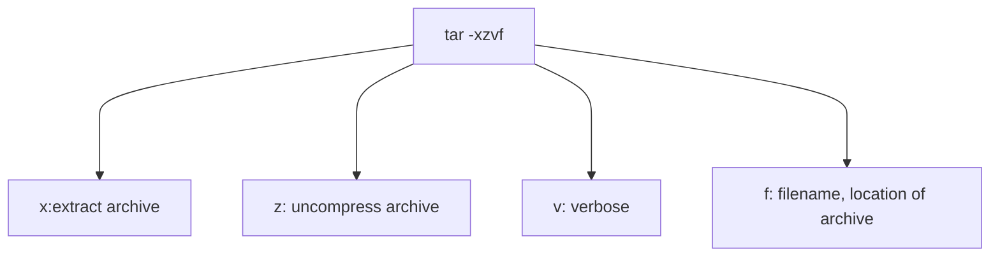
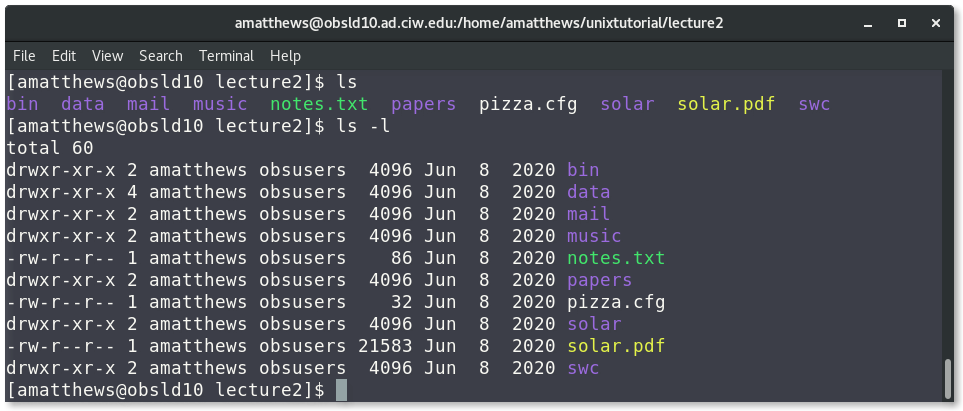
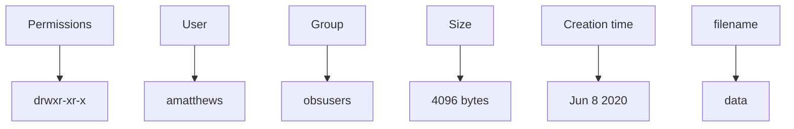
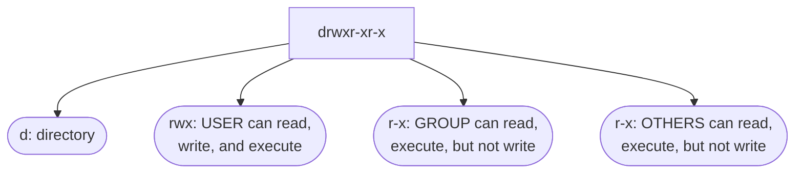

# Me, my shell, and I: Tips and tricks for working in a UNIX environment
If you have any questions---or discover cool UNIX tricks---please get in touch! You can email me at amatthews@carnegiescience.edu or find me in my office (#132). Mike and Peter are available at mgrudic@carnegiescience.edu and psenchyna@carnegiescience.edu and are in offices #1 and #1, respectively.
## UNIX Introduction
UNIX is an operating system first developed in the 1960s, but remains under constant development to this day. It is made up of three parts: 1) the kernel, 2) the shell, and 3) the programs. This is all about the shell---which interfaces between the kernel (the hub of the operating system) and the user (you!). 
<center>

### Why learn UNIX?
It's powerful, but don't take my word for it. The research publication _Nature_ listed ["Five reasons why researchers should learn to love the command line](https://www.nature.com/articles/d41586-021-00263-0)," summarized here:
1. **Wrangle files.** You can repeat simple tasks (like renaming, adding a date stamps, converting to a different format) across multiple files.
2. **Handle big data.** At a certain point, data sets become too big for GUI programs to handle. Using the command-line you can quickly sort through large numbers of files (>millions) and/or extract information from large files.
3. **Manipulate spreadsheets.** From the command line you can cut and extract columns, count words/lines/characters, filter files for a certain condition. Using the 'pipe' function you can combine these functions.
4. **Parallelize your work.** You almost always (maybe actually always?) interact with high performance computing systems (HPCs) through the command-line and bash scripts.
5. **Automate.** Anything you can type on the command line can be included in a bash/shell script. This means you can line up various commands to run after one-another, and you can even schedule them to run at a particular time!
### Opening a terminal: 
There are many ways to open a terminal (also called the "command line") on either Mac or Linux machines, but here are some quick options:
On a Mac: ⌘ _Cmd_ + _Space_ and type _terminal_, hit enter.
On a Linux: Click _Applications_ &rarr; _System Tools_ &rarr; _Terminal_.
On a Windows: (to-do)

There are different types of shells (e.g. `bash`, `csh`, `zcsh`, etc.), but we will be using the `bash` shell. To check what shell you're using, type: `echo $SHELL` in the terminal. `echo` teWe'lls the terminal to write the given text to screen. For example:
```bash
$ echo 'Am I a cat?'
Am I a cat?
```
The  before echo just indicates the beginning of the line on a Linux-based machine. It may differ depending on whether you are using a Linux  or a Mac machine.
## Directories and Navigation
Let's get familiar with navigating the filesystem on our computer. The home directory is indicated by the special character **~**. On a Mac, this is equivalent to /Users/[your computer name]. 

We're going to be downloading a sample directory to play around with, but before we do, let's create a suitable place for it to live. To make sure we are in our home directory, type `cd` in the command line, this changes to the home directory regardless of where you are in your filesystem. To create a new directory, we will use the command `mkdir`: 
```bash 
$ mkdir cassi
```
This will create a new directory named `cassi` (you can name it whatever you want!) in the home directory. To enter the directory, type `cd cassi`. If you want to list all files and subdirectories within a directory, type `ls`. Since we just created this directory, there are no files and nothing should appear.

There are two command line tools commonly used to download files from a server: `wget` and `curl`. `wget` is a simpler transfer utility that can be used with urls beginning with http,https, ftp, and ftps. `curl` has expanded capabilities, such has supporting more protocols (sets of rules governing the communication and exchange of data over the internet) and more options for uploading files. If it's a simple task, `wget` is most likely sufficient.

In the `cassi` directory, we are going to download a sample directory set to play around with. To download with `wget`:
```bash
wget https:// 
```
and to download with `curl`:
``` bash
$ curl -O https:// filename
```
Notice the `-O` in the `curl` command, this is necessary to save the contents to a file/directory, otherwise everything would be printed on the command line. `wget` will automatically saves the contents to a file/directory.

### `tar` and `zip`
Compressed and/or archived files and directories can have different file endings corresponding to the algorithm used for the compression: `.zip`, `.gz`, `.tar	`, `.tgz`, `.tar.gz`, etc. `tar` was originally designed for creating archives to store files on magnetic tape which is why it has its name “**t**ape **ar**chive”. If there is a **z** in the file extension, it means the file/directory was compressed - files ending simply in `.tar` are uncompressed. There are many options you can use with `tar` when uncompressing a file/directory. A common usage is: `tar -xzvf filename.tar.gz`.

To create an archive with `tar`, you might use something like: `tar -czvf`. To list the contents of an archive: `tar -tzvf filename`.

The **ZIP** format supports lossless file compression, and files with the extension `.zip` may contain one or more directories. To extract the contents of a `.zip` archive, use the `unzip` command: `unzip filename.zip`. If  you don't want to see the printed messages: `unzip -q filename.zip` (`-q` means quiet). Likewise, you can use `zip` in the same way to compress a file: `zip filename.zip file` or a directory: `zip -r directoryname.zip directory/`.
> ### Practice:
> Extract the contents of unixtutorial-main.zip 


### Exploring detailed information of files/directories
If you type `ls` into the command line now, you should see a list of files and subdirectories. In order to list more information on the contents, enter `ls -l`. You should see something similar to the image below.

Lines that begin with **d** indicate directories. The first column lists the file/directory permissions: **r**: read permission, **w**: write permission, **x**: execute permission. 

Let's explore the Permissions a little more:

Sometimes you may want to change the permission of a file or directory. In order to do so, you use the `chmod` command. For example, to give write permissions for the file `README.md` to _**g**roup_ members and all _**o**thers_ on the computer:
``` bash
$ chmod go+w README.md
```

Now the **u**ser, the **g**roup, and all **o**thers can write to the file `README.md`. To remove permissions, use `-` in the place of `+`. As shown above, **g** and **o** correspond to _group_ and _others_ permissions, and it follows that **u** is used when changing _user_ permissions. Without specifying **u**, **g**, or **u**, the default is to change only the user (**u**) permissions.

You may have noticed that my sample directory is named `unixpizza` instead of ``unixtutorial-main``. The `mv` (move) command changes a file's complete path, so we can use the command to simply change a file or directory name. For example, while in the `cassi` directory, you can input the following the change the directory name of `unixtutorial-main` to something easier to type.
``` bash
$ mv unixtutorial-main unixpizza
```

Suppose we want to move the `makepizza.py` file into the sub-directory: `flatbread/`. While in the `unixpizza/` directory:
``` bash
$ mv makepizza.py flatbread/makepizza.py
```
While in the `unixpizza/` directory, if you wanted to move something (the `makepizza.py` file, for example) in the `flatbread` directory back into the `unixpizza/` directory:
``` bash
$ mv flatbread/makepizza.py makepizza.py
```
OR
```bash
mv flatbread/makepizza.py .
```
The period `.` indicates the current directory, so that command is telling the computer to move the file `makepizza.py` from the `flatbread/` directory into the current directory, keeping its name `makepizza.py`. There are times when you may want to move a file to a different directory and change its name in the new directory. This can be done with one command in the terminal. For example, to move the $\texttt{python}$ program `makepizza.py` into the `flatbread/` sub-directory and change its name to `make_me_a_pizza.py`:
```bash
> mv makepizza.py flatbread/make_me_a_pizza.py
```
**WARNING**: If you use `mv` to change a filename to something that already exists in that directory, it will overwrite the existing file. There is no way to recover it.
| **COMMAND** | **ACTION** |
|--|--|
| `pwd`   | (**p**resent **w**orking **d**irectory) show the full path of your current directory |
| `cd`    | (**c**hange **d**irectory), alone this will go to your home directory |
| `cd -`  | go to the last directory you were in |
| `cd ..` | go up one directory |
| `ls`    | **l**i**s**t items in directory |
| `ls -l` | a "long listing" of items in the current directory with time of creation and file permissions |
| `mkdir` | **m**a**k**e new **dir**ectory within current directory |
| `chmod` | **ch**ange **mod**e: change the permissions of a file or directory. |
| `mv`    | move a file to a different directory or change its name |
| `cp`    | copy a file to a new filename or into a different directory |
| `cp -r` | `-r` tells the computer to copy directories **r**ecursively, saving you from having to copy files individually.
## Control Characters
Your mouse won't be able to move your cursor on the command line, but control characters allow you to move around with ease. You might even find it faster. Here are some scenarios where control characters come in handy:

1. Suppose you're trying to run a $\texttt{python}$ script and notice you made a typo at the very beginning of the line. Instead of hitting the left arrow repeatedly in frustration, you can type `cntrl-a` and your cursor will move to the start of the line.
2. Sometimes you haven't had your tea or coffee yet and you start running a program before realizing you forgot to change a parameter or filename within the code. The good news is you don't have to wait until the program finishes to go back and make your changes. Instead, typing `cntrl-c` into the terminal will cancel whatever command is running.

Below is an incomplete list of some control characters that make life just a little more efficient:
| **CONTROL CHAR** | **ACTION** |
| -- | -- |
| `cntrl-a` | move cursor to start of line |
| `cntrl-e` | move cursor to end of line |
| `cntrl-c` | cancel command |
| `cntrl-l` | clear terminal screen |
| `cntrl-k` | delete from cursor to end of line |
| `cntrl-a cntrl-k` | go to beginning of line and delete whole line |

## Tab Completion
If you start typing a few characters of a file or directory, e.g.
```bash
$ cd Downl
```
and then hit the `tab` key. The shell will automatically complete the directory (or file) name that matches the start of what you typed. This can be _very_ helpful with long filenames. The shell will complete the name until there is no longer a unique match. Example: suppose you had a directory with the following files:
 ```bash
Tile_8615432346_15.pkl 
Tile_8615432350_15.pkl
Tile_8615432357_15.pkl
 ```

Typing `ls -l Ti` and then `tab` will result in this on the command line:
```bash
$ ls -l Tile_86154323
```

Entering another character (say `4`) will result in only one unique match, and then `tab` will complete the enter filename 
```bash
$ ls -l Tile_8615432346_15.pkl
```

## Aliases
If typing `ls -l` is more trouble than it's worth, we can make an alias for it! In the terminal, type `alias`. This will list the current aliases you have set up thus far, which may be none - but that will change. To establish an alias for `ls -l`:
```bash
$ alias ll='ls -l'
```
This can also be useful if you frequently make the same typos. For example:
```bash
$ alias emasc='emacs'
```
Now, if you enter `alias` into the terminal, it should read
```bash
alias ll='ls -l'
alias emasc='emacs'
```
## Text editors via the terminal

Jupyter notebooks are useful for some things, but you often want to create and run $\texttt{python}$ programs directly from the command line. There are many text editors, but two extremely popular (and therefore likely to be available on most computers) are _emacs_ and _vim_. Scientists and programmers have been arguing about which is better for _decades_ (see above comic), but in reality they both get the job done. A good text editor to start with is _nano_. To create a file with _nano_:
```bash
nano my_new_file.txt
```

> ### Practice:
> Work with your neighbor to create a $\texttt{python}$ program that prints "Hello Carnegie!" using nano. To run your $\texttt{python}$ program, type: `python program.py` on the command line.
## Miscellaneous, but very useful, commands
A note before going through individual commands: if you ever need more information on what a command does or what additional options you can feed it to get a certain output, use `man` (**man**ual) or `--help`.
```bash
$ man cat
```

```bash
$ cat --help
```

**NB:** There is a package called `cheat` which you can download that gives much more readable information and examples. See the "Resources" section for details on installing and using it.
## `top`
There may come a time when you need to kill a program and `cntrl-c` is not doing the trick. Entering the `top` command in your terminal will list all processes on your computer with their Program ID's (PIDs). 

If you need to force kill a program, find the associated PID (3130 for example) and type 
```bash
kill 3130  
```
`top` is also useful for determining how much memory and CPU a program is using. If a program seems to be running much more slowly than you anticipated, it could be because there is no more available RAM (random access memory). 
## `cat`
The `cat` command (short for con**cat**enate) outputs the contents of a file to the command line. 

It works on multiple files.

[Here](https://www.geeksforgeeks.org/cat-command-in-linux-with-examples/?ref=lbp) is a good resource for more information and examples on how you can use `cat`, including printing the output of file with line numbers, creating files, copying the contents of a file to another. My favorite: to display the lines of a file in reverse order use `tac` instead of `cat` :joy:.


## `head`, `tail`, `wc`
The commands `head` and `tail` enable you to view the first (`head`) or last (`tail`) lines of a file without having to open it. By default, these commands will show the first/last 10 lines. If you want to only see the first/last 3 lines, you can use the `-n` option followed by the number of lines you wish to see. There is also a command called `wc` (**w**ord **c**ount) which tells you three statistics about a file: 1) the number of lines, 2) the number of words, and 3) the number of characters. See the example below.


## `grep` 
**Regular Expressions** are used for textual pattern matching and is almost a computer language onto itself. It is built into most modern programming languages (the $\texttt{python}$ package is called `re`) and text editors. On the command line, you can use regular expressions through the `grep` command (**g**et **r**egular **e**x**p**ression). To use `grep`:
```bash 
$ grep <pattern> <files to search>
```
Here are some simple search examples:
| grep input | translation |
| -- | -- |
| `$ grep cheese carne.txt` | select all lines in carne.txt containing 'cheese' |
| `$ grep '^p' carne.txt` | ^ = start of line, select all lines starting with 'p' |
| `$ grep 's$' carne.txt` | $ = end of line, select all times ending with 's' | 
_Square brackets_ match a single character. For example, `[bc]at` will match 'bat' and 'cat, but not 'hat'. You can place a range of letters or numbers inside the brackets:
| input | translation |
| -- | -- |
| `[b-k]at` | matches 'bat', 'cat', 'gat', but not 'mat' or 'pat' |
| `[3-6]5` | matches 35, 45, 55, 65, but not 75, 85, etc. |
| `[a-z]` | matches any single lowercase letter |
| `[a-zA-Z]` | matches any single upper or lowercase letter |
| `[a-zA-Z]&` | matches any character that appears at the end of a line |
| `[^abc]` | matches any character _except_ 'a', 'b', or 'c' | 
The website https://regex101.com/ allows you to test regular expressions to ensure they match the pattern you want. They also have a fun quiz to practice your regex skills!
> ### Practice:
> **Without** opening any files:
> 1. Use `grep` to find the pizzas that contain onions.
> 2. Combine `grep` and `sort` to find the pizzas that use the word "organic" the most times. (Hint: remember you can type --help after a command to see additional options!)
> 3. Head to https://regex101.com/quiz and try out their practice problems!
## `pipe`, `sort`
`pipe` allows you to input the output of one command directly into another. Suppose you want to output the _sorted_ contents of a file to the terminal. You can do this by 'piping' the output of `cat` to the command `sort`:

Truthfully, you would have gotten the same output by entering `sort pe.txt`, without the pipe. 
If you want to sort a file numerically, use the `-n` option:

> ### Practice:
> **Without** opening any files:
> 1. Combine `wc` with `sort` to list the files from those with the fewest lines to the most lines. 
> 2. Same as above, but list the files from those with the fewest characters to the most characters. (Hint: remember you can use --help after a command to see additional options!)
## Connecting to a remote machine
_(this section came from a previous tutorial put together by Drew Newman and Mahdi Qezlou - thank you!)_
This summer, some of you may be asked to connect to a remote machine or download/upload files to/from it. You can do it all from your terminal via `ssh` command (**s**ecured **sh**ell). 
**NOTE**: To connect to computers on the Carnegie network from off campus, you need to be connected via the VPN. If you need this access, please ask one of us or Chris Burns and we will get it set up. First, you need to know the domain, username, and password of the remote machine. If the remote machine is a high-performance computing center like Mies in Carnegie, ask the support group to share this info with you. You can also set up `ssh` access to a desktop located somewhere else. The simplest working example on how to use `ssh` is:
```bash
$ ssh username@domain
```
For example:
```bash
$ ssh amatthews@ssh.obs.carnegiescience.edu
```
It will ask about your password and then connect you to the shell on the remote machine. From then on, you are using the terminal on that machine.
### Transferring files to/from the remote machine:
If you need to transfer files between your local computer and the remote machine, you should use commands like `rsync`. This command is based on `ssh`; therefore, the username and passwords are the same. `rsync` recursively updates the desired files on your local or remote machines, and if any of the files already exists on the destination directory and are the same as the new one, they will not be transferred.
Example transferring from your local machine to a remote machine:
``` bash
$ rsync -a -P path/to/local/files amatthews@ssh.obs.carnegiescience.edu:/path/to/remote/files
```
Example transferring from a remote machine to your local one:
```bash
$ rsync -a -P amatthews@ssh.obs.carnegiescience.edu:/path/to/remote/files /path/to/local/destination
```
The `-a` option preserves some info on the files like ownership, groups, permission, and modification time. The `-P` option loads a progress bar and permits partial transfer in case your network cuts off. Once reconnected, using `rsync` again downloads the remaining portion of the files.

## Additional Resources
* A long [list](https://en.wikipedia.org/wiki/List_of_Unix_commands) of UNIX commands.
* `cheat` is a package you can download that enables you to type a UNIX command tight in the terminal and see the definition, how it is used, and various examples (it's really useful). 
	* You can download `cheat` using the package manager [Homebrew](https://brew.sh/).
	* If you don't have Homebrew installed, follow the instructions on the homepage to do so. 
	* To install `cheat`:
	```bash
	brew install cheat
	```
	* Or you can look at additional ways to install it [here](https://formulae.brew.sh/formula/cheat#default).
	* Here is an example of what the `cheat` command outputs when you use it. It gives you not only directions for use, but real examples with explanations. **NB:** `tail -f` can be very useful if you're having a program update a file and you want to check on its progress!
